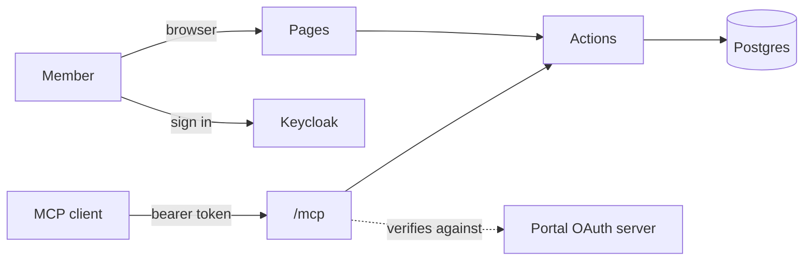

```
██████╗  ██████╗ ██████╗ ████████╗ █████╗ ██╗
██╔══██╗██╔═══██╗██╔══██╗╚══██╔══╝██╔══██╗██║
██████╔╝██║   ██║██████╔╝   ██║   ███████║██║
██╔═══╝ ██║   ██║██╔══██╗   ██║   ██╔══██║██║
██║     ╚██████╔╝██║  ██║   ██║   ██║  ██║███████╗
╚═╝      ╚═════╝ ╚═╝  ╚═╝   ╚═╝   ╚═╝  ╚═╝╚══════╝
```

# WinLab Portal

> The lab's internal apps on one Postgres: sign in with Keycloak, and everything you can click is also an MCP tool.

`nextjs` · `postgres` · `docker` · `mcp`

[](https://github.com/NYCU-WinLab/portal/actions) &nbsp;[](https://github.com/NYCU-WinLab/portal/pkgs/container/portal) &nbsp;[](#license)

WinLab members book rooms, file receipts, sign documents and open the lab door through one portal. This is its rewrite: plain Postgres instead of a hosted backend, one app at a time, and every action an agent can call as well as a member can click.

```
> "Who am I on the portal?"
  ⚡ whoami {}
✓ { "name": "王小明", "username": "ming", "email": "ming@example.com" }
```

## What it does

- **Signs members in** with the lab's Keycloak (OIDC); there are no passwords here.
- **Defines each action once**: a page and its MCP tool run the same code, so neither can drift.
- **Serves MCP** at `/mcp`, with the portal itself as the OAuth 2.1 authorization server (Client ID Metadata Documents, plus dynamic registration for older clients).

## Deploy

With Docker Compose, on any machine with Docker:

```sh
curl -fsSLO https://raw.githubusercontent.com/NYCU-WinLab/portal/main/compose.yaml
curl -fsSL -o .env https://raw.githubusercontent.com/NYCU-WinLab/portal/main/.env.example
# set POSTGRES_PASSWORD, BETTER_AUTH_URL, BETTER_AUTH_SECRET, SIGNING_MASTER_KEY and the KEYCLOAK_* keys in .env
docker compose up -d
```

This starts Postgres, runs the migrations once, then serves the portal from `ghcr.io/nycu-winlab/portal` on `127.0.0.1:3000`.

> [!IMPORTANT]
> Put a reverse proxy with TLS in front, at the host in `BETTER_AUTH_URL`. MCP clients only accept an HTTPS resource, and the Keycloak redirect URI must match it.

## Use

1. In your Keycloak realm, create a confidential OpenID Connect client with the redirect URI `<BETTER_AUTH_URL>/api/auth/callback/keycloak`, and put its ID and secret in `.env`.
2. Open `BETTER_AUTH_URL` and sign in.
3. Make the first portal admin, once, after that member has signed in (later admins are added on /admins):

   ```sh
   docker compose exec postgres psql -U portal -d portal -c \
     "insert into admins (user_id, app) select id, 'portal' from users where username = '<their account>'"
   ```

4. Add the MCP server to a client, for example `claude mcp add --transport http portal <BETTER_AUTH_URL>/mcp`, approve it on the consent page, then ask it to call `whoami`.

## Configure

Set these in `.env`; [.env.example](.env.example) documents every one.

| Key | What it sets | Default |
|-----|--------------|---------|
| `POSTGRES_PASSWORD` | The database password, used by every service | required |
| `BETTER_AUTH_URL` | The public URL; the MCP resource is `<url>/mcp` | required |
| `BETTER_AUTH_SECRET` | Signs sessions and OAuth queries | required |
| `KEYCLOAK_ISSUER` | The realm URL, e.g. `https://auth.example.com/realms/lab` | required |
| `KEYCLOAK_CLIENT_ID`, `KEYCLOAK_CLIENT_SECRET` | The portal's Keycloak client | required |
| `SIGNING_MASTER_KEY` | 32 bytes, base64: seals the signing CA's private keys (trip uploads are signed with PAdES B-LT); keep a copy, losing it means a new CA | required |
| `PORTAL_VERSION` | Image tag | `main` |
| `PORTAL_BIND`, `PORTAL_PORT` | Where web listens on the host | `127.0.0.1`, `3000` |
| `OTEL_EXPORTER_OTLP_ENDPOINT` | OTLP/HTTP endpoint for traces and error logs; off when empty | empty |

## How it works



Keycloak proves who a member is; the portal keeps its own session and is the authorization server for MCP, so the lab-wide realm never opens client registration. An MCP token carries the member's id and acts with exactly their permissions. Only `lib/actions`, `lib/auth` and `lib/db` may touch the database, and CI checks that every action is in the registry the MCP tools are built from.

## Develop

```sh
bun install
cp .env.example .env.local   # point DATABASE_URL at a local Postgres
bun run db:migrate
bun run dev
```

CI runs typecheck, lint, format, the design token check, the action registry check and a build, then builds the image and probes a real `docker compose up`. Schema changes go through `bun run db:generate`; see [CLAUDE.md](CLAUDE.md) for the conventions.

## Limitations

- Only the sign-in, member record and MCP surface exist so far; the apps move over from portal.winlab.tw one at a time.
- One instance: DPoP replay records are in Postgres, but nothing else has been tried with more than one web container.

## Contributing

Issues and PRs welcome: start with [CONTRIBUTING.md](https://github.com/zyx1121/.github/blob/main/CONTRIBUTING.md).

## License

[MIT](LICENSE) · made in a lab whose door has its own MCP tool
